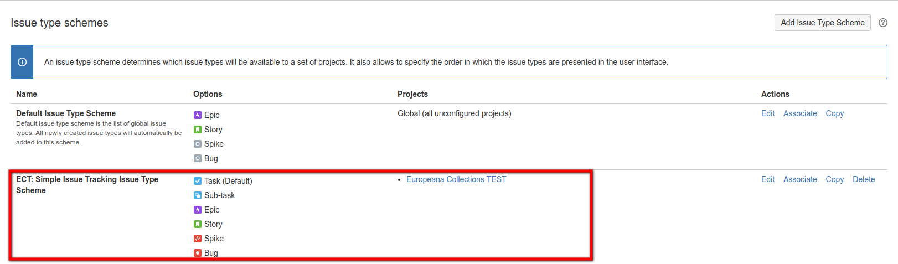

# Assembla-to-Jira

A collection of advanced tooling for a complete data migration from [Assembla](https://www.assembla.com) to [JIRA](https://www.atlassian.com/software/jira).

## Introduction

Have you ever wanted to use JIRA instead of Assembla, but were afraid that the switch to Jira was too risky because you already have so much important data in Assembla?

JIRA does offer a number of standard add-ons to make migration easier, but unfortunately it does not offer any tools for migrating to Assembla.

However, you are now in luck! By using these Assembla-to-Jira migration tools, it should be very easy to export all of the relevant Assemebla data and import most (if not all) of it into a Jira project.

Usage is made of the [Assembla API](http://api-docs.assembla.cc/content/api_reference.html) and the [JIRA API](https://docs.atlassian.com/jira/REST/cloud/) in order to hook up both environments and make the data transformations.

Most of the actions can be done automatically via a pipeline of scripts, after proper configuration of the required parameters in the `.env` file.

However, there are a few manual actions required since the Jira API does not support all possible actions, but these are minimal. It is important NOT to skip these manual changes, as the successful migration depends on them.

## Installation

The toolset has been written with the [Ruby programming language](https://www.ruby-lang.org). In order to be able to use it, you will have to have downloaded and installed the following on your computer:

* [Ruby](https://www.ruby-lang.org/en/downloads)
* [Bundler](http://bundler.io)
* [Git](https://git-scm.com/downloads)

Once this has been done, you can checkout and install the toolset from the github repository.

```
$ git clone https://github.com/kgish/assembla-to-jira.git
$ cd assembla-to-jira
$ gem install bundler
$ bundle install
```

At this point everything should be ready to use as explained in the following sections.

## Pipeline Steps

The complete migration from start to finish consists of a series of scripts which are to be executed in order.

Like a pipeline, each script processes data and generates a dump file to store the intermediate results which in turn are used as input for the following script.

The reason for doing this that if something goes wrong you do not lose everything and can restart from the previous step.

Each step will generate a log of the results in the form of a csv file for reference purposes, e.g. detecting which requests failed and why. For example, importing tickets will create the `data/jira/jira-tickets.csv` file.

### Assembla export

1. Space
2. Tickets
3. Report users
4. Report tickets

### Jira import

5. Create projects
6. Create issue link types
7. Get issue types
8. Get issue priorities
9. Get issue resolutions
10. Get user roles
11. Get issue statuses
12. Get projects
13. Import users
14. Import tickets
15. Import ticket comments
16. Download ticket attachments
17. Import ticket attachments
18. Update ticket status (resolutions)
19. Update ticket associations

## Preparations

You will need to goto to the Jira website and login as admin.

Optionally create the new project. This not necessary, as during the imoprt the existence of the project will be checked and created on the fly if needed.

Define the project `.env` file as `ASSEMBLA_SPACES=project_name`.

Create the following new issue type:
* Spike
* Bug

The issue type `spike` or `bug` will be defined for any tickets whose summary starts with `Spike: ` or `Bug: `.

 Additionally, any tickets whose summary starts with `Epic :` will be defined as issue type `epic` (already part of the default Jira ticket types on project creation).


Create the following custom fields (text field read-only):

* Assembla-Id
* Assembla-Theme
* Assembla-Status
* Assembla-Milestone
* Assembla-Reporter
* Assembla-Assignee
* Assembla-Completed

and assign them to the following screens:

* Simple Issue Tracking Create Issue
* Simple Issue Tracking Edit/View Issue

Otherwise the ticket import will fail with the error message `Field 'field-name' cannot be set. It is not on the appropriate screen, or unknown`.


The same applies to the following additional (default) fields:

* Epic Name
* Rank
* Assignee
* Labels


You will also need to configure the `issue type scheme` for the project like this:



### Environment

An example configuration file `.env.example` is provided for you to define a number evironment parameters which affect the behavior.

```
ASSEMBLA_API_HOST=https://api.assembla.com/v1
ASSEMBLA_API_KEY=api-key
ASSEMBLA_API_SECRET=api-secret
ASSEMBLA_URL_TICKETS=https://app.assembla.com/spaces/space_1/tickets
ASSEMBLA_SPACES=space_1,space_2,space_3
JIRA_API_HOST=https://europeana.atlassian.net/rest/api/2
JIRA_API_PROJECT_NAME=project_name
JIRA_API_ADMIN_USERNAME=john.doe
JIRA_API_ADMIN_PASSWORD=secret
JIRA_API_UNKNOWN_USER=unknown.user
TICKETS_CREATED_ON=YYYY-MM-DD
DEBUG=false
```

By using the filter `TICKETS_CREATED_ON` you can limited the tickets to those that were created on or after the date indicated. So for example:

```
TICKETS_CREATED_ON=2017-06-01
```

would only include those tickets created on or after the first of June in the year 2017.

```
$ cp .env.example .env
```

## Export data from Assembla

You can run the export in a number of stages, output files being generated at each point in the process.

The output files are located in the directory `data/assembla/:space/:project` as follows:

```
$ ruby 01-assembla_export_space.rb # => space_tools.csv, users.csv, user_roles.csv tags.csv \
    milestones.csv, tickets-statuses.csv, tickets-custom-fields.csv, documents.csv, \
    wiki_pages.csv, tickets.csv
$ ruby 02-assembla_export_tickets.rb # => ticket-comments.csv, ticket-attachments.csv, \
    ticket-tags.csv, ticket-associations.csv
$ ruby 03-assembla_report_users.rb # => report-users.csv
$ ruby 04-assembla_report_tickets.rb # => report-tickets.csv
```

## Import data into Jira

You can run the import in a number of stages, output files being generated at each point in the process.

### Create projects

```
$ ruby 05-jira_create_projects.rb # => data/jira/jira-projects.csv
```

### Create issue link types

```
$ ruby 07-jira_create_issuelink_types.rb # => data/jira/jira-issuelink-types.csv
```

### Get general information

```
$ ruby 07-jira_get_issue_types.rb # => data/jira/jira-issue-types.csv
$ ruby 08-jira_get_priorities.rb  # => data/jira/jira-priorities.csv
$ ruby 09-jira_get_resolutions.rb # => data/jira/jira-resolutions.csv
$ ruby 10-jira_get_roles.rb       # => data/jira/jira-roles.csv
$ ruby 11-jira_get_statuses.rb    # => data/jira/jira-statuses.csv
$ ruby 12-jira_get_projects.rb    # => data/jira/jira-projects.csv
```

### Import users

```
POST /rest/api/2/user
{
  name: user['login'],
  password: user['login'],
  emailAddress: user['email'],
  displayName: user['name']
}
```

Read in the Assembla user file `data/:space/:project/users.csv` and create the Jira users if they do not already exist.

```
$ ruby 13-jira_import_users.rb # => data/jira/jira-users.csv
```

The following user:

* unknown.user@europeana.eu

as defined in the `.env` file as `JIRA_API_UNKNOWN_USER`.

### Import tickets

```
POST /rest/api/2/issue
{
  create: {},
  fields: {
    project: { id: project_id },
    summary: summary,
    issuetype: { id: issue_type[:id] },
    assignee: { name: assignee_name },
    reporter: { name: reporter_name },
    priority: { name: priority_name },
    labels: labels,
    description: description,
    ...
    customfield_assembla_id: ticket_number,
    customfield_assembla_theme: theme_name,
    customfield_assembla_status: status_name,
    customfield_assembla_milestone: milestone[:name],
    customfield_rank: story_rank,

    customfield_assembla_reporter: UNKNOWN_USER, # if reporter is missing
    customfield_assembla_assignee: '',           # if assignee cannot be assigned issues
    customfield_epic_name: EPIC_NAME,            # if issue type is epic
    parent: { id: parent_id },                   # if issue type is sub-task
    ...
  }
}
```

Now you are ready to import all of the tickets. Execute the following command:

```
$ ruby 14-jira_import_tickets.rb # => data/jira/jira-tickets.csv
```

Results are saved in the output file `data/jira/jira-tickets-all.csv` with the following columns:

```
jira_ticket_id|jira_ticket_key|project_id|summary|issue_type_id|issue_type_name|assignee_name| \
reporter_name|priority_name|status_name|labels|description|assembla_ticket_id|assembla_ticket_number| \
theme_name|milestone_name|story_rank
```

For the individual issue types `data/jira/jira-tickets-{issue-type}.csv` where `issue-type` is: bug, epic, spike, story, task or sub-task.

### Import comments

```
POST /rest/api/2/issue/{issueIdOrKey}/comment
{
  body: "comments go here..."
}
```

Now you are ready to import all of the comments. Execute the following command:

```
$ ruby 15-jira_import_comments.rb # => data/jira/jira-comments.csv
```

Results are saved in the output file `data/jira/jira-comments.csv` with the following columns:

```
jira_comment_id|jira_ticket_id|assembla_comment_id|assembla_ticket_id|user_login|body
```

### Download attachments

Before the attachments can be imported, they must first be downloaded to a local directory after which they can be imported into Jira.

This is accomplished by executing the following command:

```
$ ruby 16-jira_download_attachments.rb # => data/jira/jira-attachments-download.csv
```

The downloaded attachments are placed in the `data/jira/attachments` directory with the same filename, and the meta information is logged to the file `data/jira/jira-attachments-download.csv` containing the following columns:

```
created_at|assembla_ticket_id|jira_ticket_id|filename|content_type
```

which is used to import the attachments into Jira in the following section. A check is made if the file already exists in order to avoid name collisions.

### Import attachments

`curl -D- -u admin:admin -X POST -H "X-Atlassian-Token: no-check" -F "file=@myfile.txt" api/2/issue/{issueIdOrKey}/attachments`

Now you are ready to import all of the attachments. Execute the following command:

```
$ ruby 17-jira_import_attachments.rb # => data/jira/jira-attachments-import.csv
```

### Update ticket status

Now you are ready to update the Jira tickets in line with the original Assembla state. Execute the following command:

```
$ ruby 18-jira_update_status.rb # => data/jira/jira-update-status.csv
```

### Update ticket associations

For the default Assembla associations the relationship names are:

|  #  | Name      | Ticket2           | Ticket1       |
| --- | --------- | ----------------- | ------------- |
|  0  | Parent    | is parent of      | is child of   |
|  1  | Child     | is child of       | is parent of  |
|  2  | Related   | related to        |               |
|  3  | Duplicate | is duplication of |               |
|  4  | Sibling   | is sibling of     |               |
|  5  | Story     | is story          | is subtask of |
|  6  | Subtask   | is subtask of     | is story      |
|  7  | Dependent | depends on        |               |
|  8  | Block     | blocks            |               |

0 - Parent (ticket2 is parent of ticket1 and ticket1 is child of ticket2)
1 - Child  (ticket2 is child of ticket1 and ticket2 is parent of ticket1)
2 - Related (ticket2 is related to ticket1)
3 - Duplicate (ticket2 is duplication of ticket1)
4 - Sibling (ticket2 is sibling of ticket1)
5 - Story (ticket2 is story and ticket1 is subtask of the story)
6 - Subtask (ticket2 is subtask of a story and ticket1 is the story)
7 - Dependent (ticket2 depends on ticket1)
8 - Block (ticket2 blocks ticket1)

For the default Jira issue link types we have:

| Name      | Inward           | Outward    |
| --------- | ---------------- | ---------- |
| Blocks    | is blocked by    | blocks     |
| Cloners   | is cloned by     | clones     |
| Duplicate | is duplicated by | duplicates |
| Relates   | relates to       | relates to |

```
POST /rest/api/2/issueLink
{
  type: {
    name: name
  },
  inwardIssue: {
    id: ticket1_id
  },
  outwardIssue: {
    id: ticket2_id
  }
}
```

However, since Jira already takes care of a number of issue links during issue creation (story, subtask, etc), we should disable them in the `.env` configuration file like this:

```
ASSEMBLA_SKIP_ASSOCIATIONS=parent,child,story,subtask
```

If for some reason you do not want to do this, simple comment out the line, or if you prefer to skip other Assembla association just edit the line.

Now you are ready to update the Jira tickets to reflect the original Assembla associations. Execute the following command:

```
$ ruby 19-jira_update_association.rb # => data/jira/jira-update-associations.csv
```

## Ticket field convertions

Most of the ticket fields are converted from Assembla to Jira via a one-to-one mapping and are indicated as **bold** below.

### Assembla ticket fields:
* id
* **number**
* **summary**
* **description**
* **priority** (1 - Highest, 2 - High, 3 - Medium, 4 - Low, 5 - Lowest)
* **completed_date**
* component_id
* **created_on**
* permission_type
* **importance** (Sorting criteria for Assembla Planner) => 10104 Rank
* is_story (true or false, if true hierarchy_type = 2)
* **milestone_id** => 10103 Sprint
* **notification_list**
* **space_id**
* **state**
    * 0 - closed, 1 - open
* **status** (new, in progress, blocked, testable, ready for acceptance,
          in acceptance testing, ready for deploy, done, invalid)
* **story_importance** (1 - small, 4 - medium, 7 - large) => 10105 Story Points
* updated_at
* working_hours
* estimate
* total_estimate
* total_invested_hours
* total_working_hours
* **assigned_to_id**
* **reporter_id**
* **custom_fields** (theme)
* **hierarchy_type** (0 - No plan level, 1 - Subtask, 2 - Story, 3 - Epic)
* due_date

### Jira issue fields:

#### Default
* **issuetype**
* timespent
* **project**
* fixVersions
* aggregatetimespent
* resolution (done, won't do, duplicate)
* resolutiondate
* workratio
* lastViewed
* **watches**
* thumbnail
* **created**
* **priority** (1 - Highest, 2 - High, 3 - Medium, 4 - Low, 5 - Lowest)
* **labels**
* timeestimate
* aggregatetimeoriginalestimate
* versions
* **issuelinks**
* **assignee**
* **updated**
* **status** (todo, done)
* components
* **issuekey**
* timeoriginalestimate
* **description**
* timetracking
* security
* **attachment**
* aggregatetimeestimate
* **summary**
* **creator**
* **subtasks**
* **reporter**
* aggregateprogress
* environment
* duedate
* progress
* **comments**
* votes
* worklog

#### Custom
* 10000 Development
* 10001 Team
* 10002 Organizations
* **10003** Epic Name
* 10004 Epic Status
* 10005 Epic Color
* 10006 Epic Link
* **10007** Parent Link
* 10100 \[CHART] Date of First Response
* 10101 \[CHART] Time in Status
* 10102 Approvals
* **10103 Sprint**
* **10104 Rank**
* **10105 Story Points**
* 10108 Test sessions
* 10109 Raised during
* 10200 Testing status
* 10300 Capture for JIRA user agent
* 10301 Capture for JIRA browser
* 10302 Capture for JIRA operating system
* 10303 Capture for JIRA URL
* 10304 Capture for JIRA screen resolution
* 10305 Capture for JIRA jQuery version
* **10400 Assembla**

### Associations

The Assembly associations are converted into Jira issue links.

```
0 - Parent (ticket2 is parent of ticket1 and ticket1 is child of ticket2)
1 - Child  (ticket2 is child of ticket1 and ticket2 is parent of ticket1)
2 - Related (ticket2 is related to ticket1)
3 - Duplicate (ticket2 is duplication of ticket1)
4 - Sibling (ticket2 is sibling of ticket1)
5 - Story (ticket2 is story and ticket1 is subtask of the story)
6 - Subtask (ticket2 is subtask of a story and ticket1 is the story)
7 - Dependent (ticket2 depends on ticket1)
8 - Block (ticket2 blocks ticket1)
```

See: http://api-docs.assembla.cc/content/ref/ticket_associations_fields.html

### Statuses and states

The Assembla ticket statuses are: `new`, `in progress`, `blocked`, `testable`, `ready for acceptance`, `in acceptance testing`, `ready for deploy`, `done` and `invalid`.

An Assembla ticket can have two states: `0 - closed` (done or invalid) and `1 - open` (all others).

The Jira statuses are: `todo` and `done`. On creation, all Jira tickets are set initially to `todo` by default.

The possible transitions for this initial `todo` state are `start progress` => `in progress` and `done` => `done`.

During the migration, Assembla tickets that are marked as `closed` will result in Jira issues marked as `done` with resolution set to `fixed` for Assembla ticket status `done` and `won't fix` for Assembla ticket status `invalid`.

For Assembla tickets marked as `in progress` the imported Jira issue will be set to `in progress`.

IMPORTANT: all the other statuses will be ignored unless the administrator modifies the workflow for the given Jira project to include them explicitly.

The names of these newly defined transtitions MUST be the same as the Assembla status names in order for the status migration to work properly.

### Components

For the time being components have not yet been implemented.

## Markdown

The [Assembla markdown](http://assemble.io/docs/Cheatsheet-Markdown.html) syntax is differeent from [JIRA Markdown](https://jira.atlassian.com/secure/WikiRendererHelpAction.jspa?section=all). Therefore, the certain markdown notations need to be translated ast push follows.

### Equivalent (no changes required)

```
h1. TITLE
h2. TITLE
*bold*
_italic_
Bullet list
Numbered list
Numbered - Bullet list
```

### Ignore (will be ignored and passed through unchanged)

```
[[image:IMAGE]]
Code snippet
Wiki links
[[ticket:NUMBER]]
[[user:NAME]]
[[user:NAME|TEXT]]
```

### Reformat (will be reformatted into Jira markdown)

```
@inline code@ => {inline code}
[[url:URL|TEXT]] => [TEXT|URL]
[[url:URL]] => [URL|URL]
```

For the content available in the ticket summaries, descriptions and comments we have:

```
[summary, description, comments].each do |content|
  content = reformat_markdown(content)
end
```

where reformat_markdown will do the following global substitutions:

```
gsub(/\[\[url:(.*)\|(.*)\]\]/, '[\2|\1]')
gsub(/\[\[url:(.*)\]\]/, '[\1|\1]')
gsub(/@([^@]*)@/, '{\1}')
```

## Trouble-shooting

* Error "User cannot be assigned issues." => activate, login as user and then deactivate.
* If issue is an epic then the epic name custom field is required.
* XSRF check failed => This is a known [bug](https://confluence.atlassian.com/jirakb/rest-api-calls-with-a-browser-user-agent-header-may-fail-csrf-checks-802591455.html).
* otherwise the ticket import will fail with the error message `Field 'field-name' cannot be set. It is not on the appropriate screen, or unknown`, ensure that the custom field 'field-name' has been created and assigned to the required screens (see above).
* Error `key='customfield_10100 (Assembla-Completed)', reason='Operation value must be a number'`, ensure that the custom field is the correct type: text field read-only.

## To do

With such a complicated tool, there'll always be some loose ends and/or additional work to be done at a later time. Hopefully in the not so distant future, I'll have some time to tackle one or more of the following items:

* Transition ticket status to blocked, testable, ready for acceptance, in acceptance testing, ready for deploy, e.g. in line with the original Assembla workflow
* Implement components
* Implement extra markdown: image, ticket number, user name and code snippets
* Assign original authors to tickets, comments, attachments on creation
* Convert Assembla notification list to Jira followers
* Refactor and cleanup code, removing duplication and rubocop warnings.

## References

* Assembla
    * [Website](https://www.assembla.com)
    * [API Reference](http://api-docs.assembla.cc/content/api_reference.html)
    * [Markdown](http://assemble.io/docs/Cheatsheet-Markdown.html)

* JIRA
    * [Website](https://www.atlassian.com/software/jira)
    * [API Reference](https://docs.atlassian.com/jira/REST/cloud/)
    * [Markdown](https://jira.atlassian.com/secure/WikiRendererHelpAction.jspa?section=all)

## License

Licensed under the EUPL V.1.1.

For full details, see [LICENSE.md](LICENSE.md).

## Author

Kiffin Gish

kiffin.gish@planet.nl

http://gishtech.com
